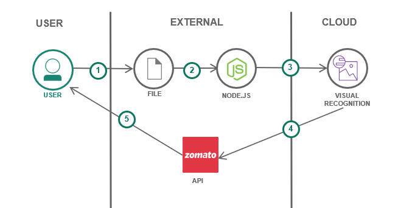

# FoodApp
This project aims to detect pictures of food and help the user find restaurants near them that serve the food in the uploaded picture using zomato API.  
Tools: Node.js, IBM Watson Visual Recognition, Zomato API. 
## Architecture Diagram

### Steps:
1- User uploads image to the Application. 
2- Image is sent to IBM Watson Visual Recognition to get analyzed. 
3- Results are retrieved from Watson VR and processed. 
4- Processed results are sent to Zomato API. 
5- Results are retrieved from Zomato API and processed. 
6- Results are sent to user. 
### Features:
- Users can upload local images or online images. 
- Users can filter their queries. 
- List restaurants that offer the suggested dishes.
